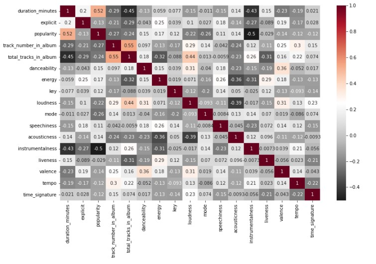
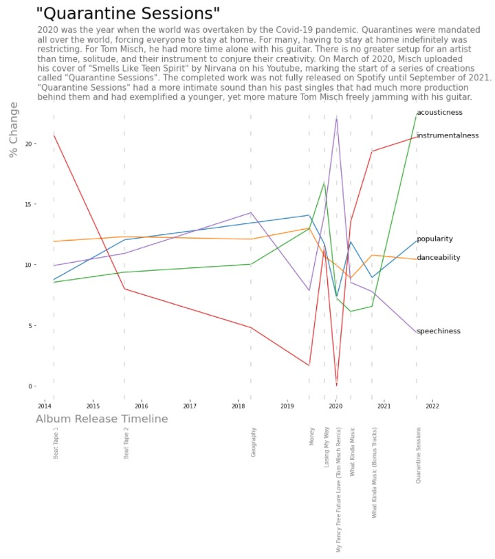

# Spotify Analysis on Tom Misch: Project Overview

- Data accessed and extracted from the Spotify Web API using the Spotipy library.
- Cleaned data and explored correlations between variables.
- Created multi-line plot that illustrates how Tom Misch's music has changed with each album and single release on Spotify.

## Code and Resources Used

**Python Version:** 3.9.9

**Packages:** spotipy, time, pandas, numpy, seaborn, matplotlib

**YouTube Tutorial:** ["Working with APIs in Python" by Nate at StrataScratch](https://www.youtube.com/watch?v=fklHBWow8vE)

**Article Guide:** ["How to Extract Any Artist’s Data Using Spotify’s API, Python, and Spotipy" by Angelica Dietzel](https://betterprogramming.pub/how-to-extract-any-artists-data-using-spotify-s-api-python-and-spotipy-4c079401bc37)

**API Authentication:** [Spotify for Developers](https://developer.spotify.com/)

**Library Documentation:** [Spotipy](https://spotipy.readthedocs.io/en/2.9.0/#/)
## API Data Extraction

Used the Spotify API article as a guide to extract information on 123 of Tom Misch's tracks on Spotify. For each track, we uncovered the following:
- Track ID
- Track Name
- Duration of Track (Milliseconds)
- Explicit Language?
- Popularity
- Album ID
- Album Name
- Album Release Date
- Number Position of a Track in Album
- Total Number of Tracks in Album
- Danceability
- Energy
- Key
- Loudness
- Mode
- Speechiness
- Acousticness
- Instrumentalness
- Liveness
- Valence
- Tempo
- Time Signature

## Data Cleaning

After extracting the data and storing it into a csv file and pandas dataframe, the data had to be cleaned for proper analysis and visualizations. The following changes were made:

- Dropping duplicates rows of albums where the album name was the same but the album id was different.
- Adjusted the `duration_milliseconds` column to be expressed in minutes instead of milliseconds; changed the column name to `duration_minutes`.
- Corrected the data type of the `album_release_date` column to `datetime`.
## EDA

Analyzed data to explore relationships between columns and prepared the specific data needed to create the visualizations.
- Looked at correlations across all numerical columns
- Chose specific columns for multi-line plot visuals
- Checked those columns for outliers by using boxplots
- Aggregated the rows to find each columns' mean by album
- Converted those averages into percentages so that percent change over time can be visualized.
## Screenshots

4th visual out of a series of 4 visuals that illustrates the progression of change throughout Tom Misch's career.

